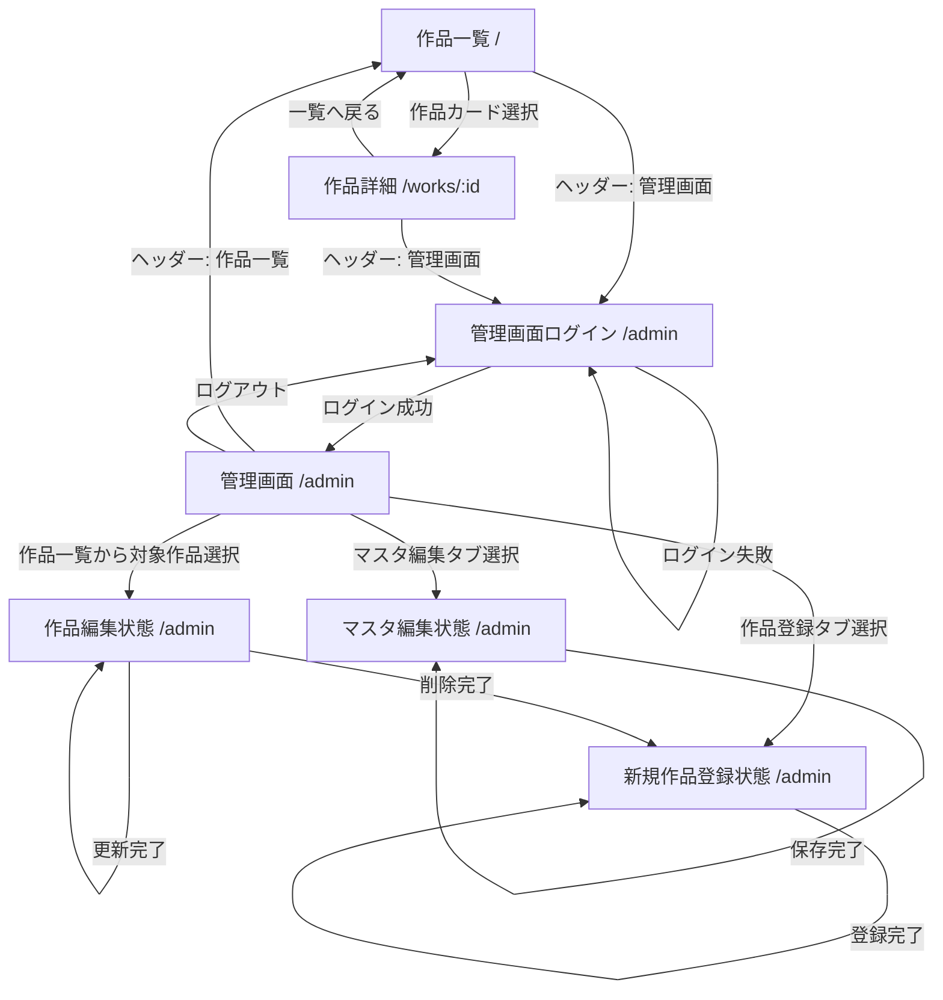

# 画面遷移図

## 画面一覧

- `/`
  - 作品一覧
- `/works/:id`
  - 作品詳細
- `/admin`
  - 未ログイン時: 管理画面ログイン
  - ログイン時: 管理画面

## 画面遷移

## 管理画面内の状態遷移

- `作品登録`
  - 新規作品の入力フォームを表示
  - 登録完了後も新規登録フォームのまま維持
- `作品編集`
  - 左側一覧から作品を選択したときの状態
  - 更新後は同じ作品の編集状態を維持
- `マスタ編集`
  - 各カテゴリの選択肢を 1 画面で編集

## ヘッダー導線

- すべての画面から `作品一覧` へ戻れる
- `管理画面` は常にヘッダーから遷移可能
- ログイン中のみヘッダー右側に `ログアウト` を表示
