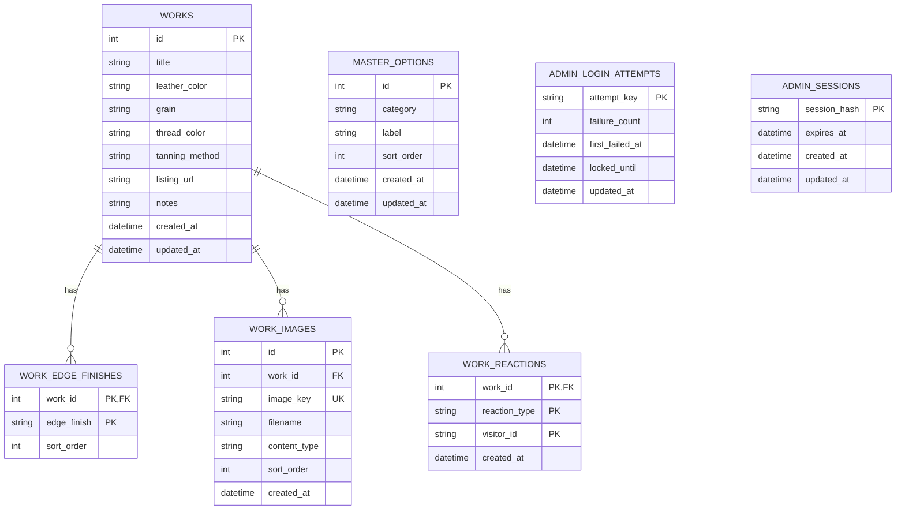

# ER 図

## ER 図

## テーブル説明

### `works`

作品の主データを保持します。

### `work_edge_finishes`

作品ごとのヘリ処理を複数保持します。  
`work_id + edge_finish` が主キーです。

### `work_images`

作品画像のメタ情報を保持します。  
画像本体は R2 に保存し、このテーブルにはキーとファイル情報だけを保存します。

### `work_reactions`

匿名ユーザーの `like` / `request` を保持します。  
同一 `visitor_id` が同一作品に同じリアクションを重複登録できないよう、複合主キーで制御します。

### `master_options`

選択肢マスタをカテゴリ単位で保持します。

### `admin_login_attempts`

管理画面ログイン失敗回数を保持し、ブルートフォース対策に使います。

### `admin_sessions`

管理者セッションをサーバー側で保持します。  
ログアウト時や失効時に無効化できるようにするためのテーブルです。

## モデリング上の注意

- `works` は `master_options` を外部キー参照していません。
- 作品に選択された値は文字列として保存されます。
- そのため、マスタ変更後でも過去作品の表示値が壊れにくい設計です。
- 代わりに、入力時の整合性はアプリケーションのバリデーションで保証しています。
