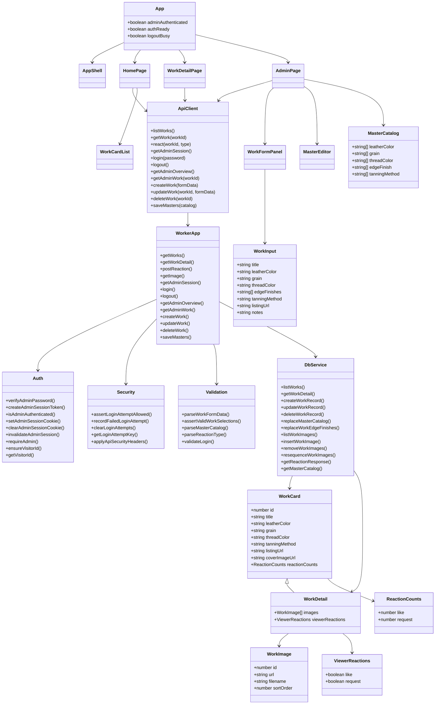

# クラス図

## 説明

実装は関数ベースですが、保守しやすいように責務単位の論理クラス図として整理しています。

## クラス図

## 責務分割

### フロントエンド

- `App`
  - セッション状態とルーティングを管理
- `HomePage`
  - 公開一覧取得と表示
- `WorkDetailPage`
  - 作品詳細取得とリアクション送信
- `AdminPage`
  - 管理画面の状態制御
- `WorkFormPanel`
  - 作品登録・更新フォーム
- `MasterEditor`
  - マスタ編集フォーム

### バックエンド

- `WorkerApp`
  - ルーティングとリクエスト処理
- `Auth`
  - Cookie セッションと認証判定
- `Security`
  - ログイン試行制御とセキュリティヘッダー
- `Validation`
  - 入力値検証
- `DbService`
  - D1 アクセスとデータ組み立て
