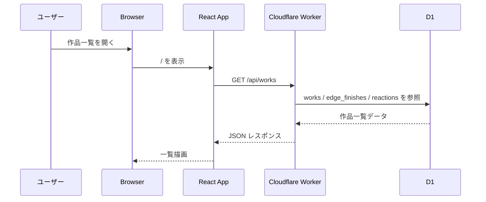
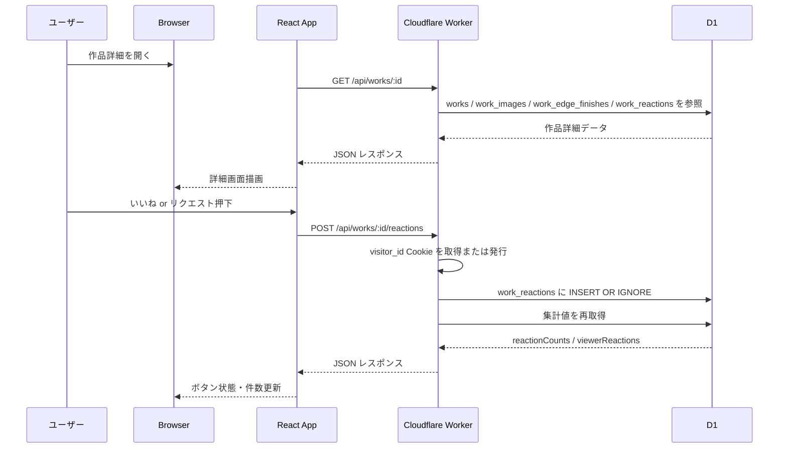
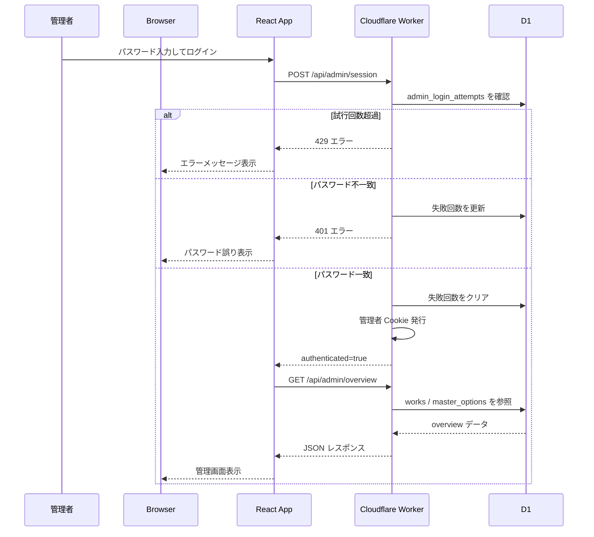
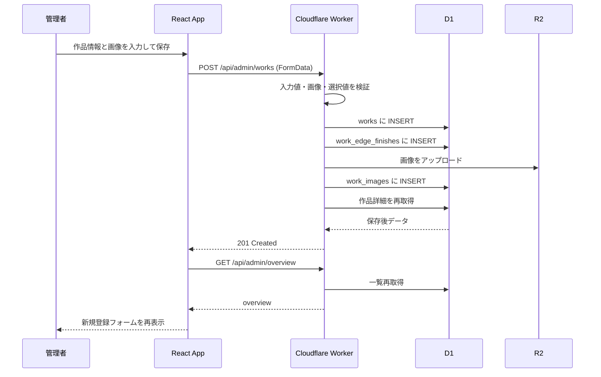
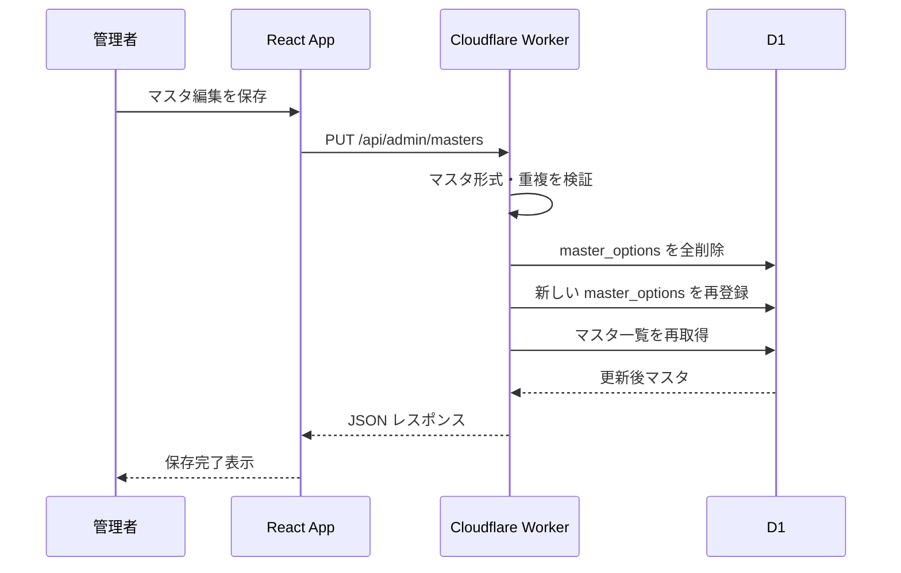

# シーケンス図

## 1. 公開一覧表示

```mermaid
sequenceDiagram
    participant User as ユーザー
    participant Browser as Browser
    participant App as React App
    participant Worker as Cloudflare Worker
    participant D1 as D1

    User->>Browser: 作品一覧を開く
    Browser->>App: / を表示
    App->>Worker: GET /api/works
    Worker->>D1: works / edge_finishes / reactions を参照
    D1-->>Worker: 作品一覧データ
    Worker-->>App: JSON レスポンス
    App-->>Browser: 一覧描画
```

## 2. 作品詳細表示とリアクション

```mermaid
sequenceDiagram
    participant User as ユーザー
    participant Browser as Browser
    participant App as React App
    participant Worker as Cloudflare Worker
    participant D1 as D1

    User->>Browser: 作品詳細を開く
    App->>Worker: GET /api/works/:id
    Worker->>D1: works / work_images / work_edge_finishes / work_reactions を参照
    D1-->>Worker: 作品詳細データ
    Worker-->>App: JSON レスポンス
    App-->>Browser: 詳細画面描画

    User->>App: いいね or リクエスト押下
    App->>Worker: POST /api/works/:id/reactions
    Worker->>Worker: visitor_id Cookie を取得または発行
    Worker->>D1: work_reactions に INSERT OR IGNORE
    Worker->>D1: 集計値を再取得
    D1-->>Worker: reactionCounts / viewerReactions
    Worker-->>App: JSON レスポンス
    App-->>Browser: ボタン状態・件数更新
```

## 3. 管理画面ログイン

```mermaid
sequenceDiagram
    participant Admin as 管理者
    participant Browser as Browser
    participant App as React App
    participant Worker as Cloudflare Worker
    participant D1 as D1

    Admin->>App: パスワード入力してログイン
    App->>Worker: POST /api/admin/session
    Worker->>D1: admin_login_attempts を確認

    alt 試行回数超過
        Worker-->>App: 429 エラー
        App-->>Browser: エラーメッセージ表示
    else パスワード不一致
        Worker->>D1: 失敗回数を更新
        Worker-->>App: 401 エラー
        App-->>Browser: パスワード誤り表示
    else パスワード一致
        Worker->>D1: 失敗回数をクリア
        Worker->>Worker: 管理者 Cookie 発行
        Worker-->>App: authenticated=true
        App->>Worker: GET /api/admin/overview
        Worker->>D1: works / master_options を参照
        D1-->>Worker: overview データ
        Worker-->>App: JSON レスポンス
        App-->>Browser: 管理画面表示
    end
```

## 4. 作品登録

```mermaid
sequenceDiagram
    participant Admin as 管理者
    participant App as React App
    participant Worker as Cloudflare Worker
    participant D1 as D1
    participant R2 as R2

    Admin->>App: 作品情報と画像を入力して保存
    App->>Worker: POST /api/admin/works (FormData)
    Worker->>Worker: 入力値・画像・選択値を検証
    Worker->>D1: works に INSERT
    Worker->>D1: work_edge_finishes に INSERT
    Worker->>R2: 画像をアップロード
    Worker->>D1: work_images に INSERT
    Worker->>D1: 作品詳細を再取得
    D1-->>Worker: 保存後データ
    Worker-->>App: 201 Created
    App->>Worker: GET /api/admin/overview
    Worker->>D1: 一覧再取得
    Worker-->>App: overview
    App-->>Admin: 新規登録フォームを再表示
```

## 5. マスタ編集

```mermaid
sequenceDiagram
    participant Admin as 管理者
    participant App as React App
    participant Worker as Cloudflare Worker
    participant D1 as D1

    Admin->>App: マスタ編集を保存
    App->>Worker: PUT /api/admin/masters
    Worker->>Worker: マスタ形式・重複を検証
    Worker->>D1: master_options を全削除
    Worker->>D1: 新しい master_options を再登録
    Worker->>D1: マスタ一覧を再取得
    D1-->>Worker: 更新後マスタ
    Worker-->>App: JSON レスポンス
    App-->>Admin: 保存完了表示
```
