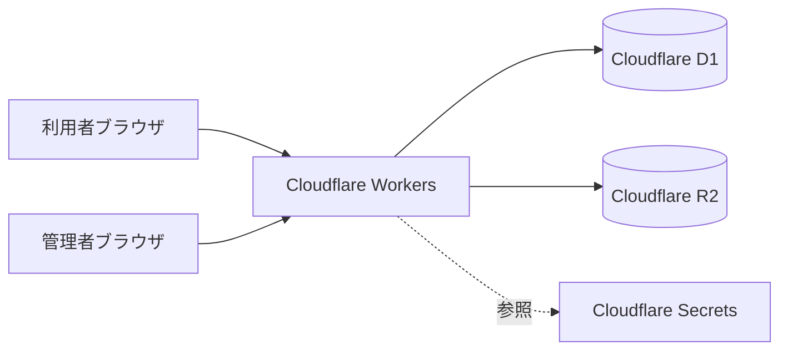
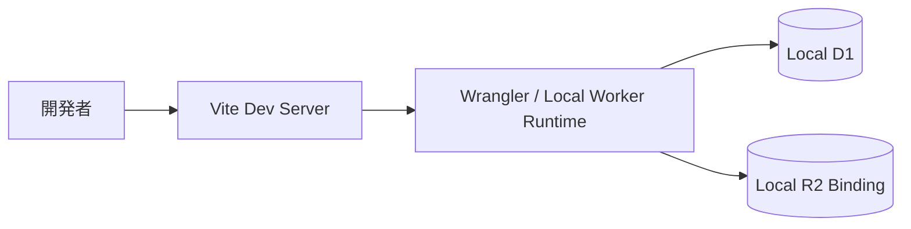

# インフラ構成（利用サービス）

## 利用サービス

- Cloudflare Workers
  - フロント配信
  - API 実行
- Cloudflare D1
  - 作品、画像メタデータ、リアクション、マスタ、ログイン試行履歴の保存
- Cloudflare R2
  - 作品画像ファイルの保存
- Cloudflare Secrets
  - `ADMIN_PASSWORD`
  - `SESSION_SECRET`
- Vite
  - フロントエンドのビルド
- Wrangler
  - ローカル実行、デプロイ、D1 マイグレーション

## 構成図

## 役割分担

### Cloudflare Workers

- React のビルド成果物を配信
- `/api/*` のエンドポイントを提供
- セッション Cookie の発行・検証
- 入力値のバリデーション
- 画像アップロード制御

### D1

- 作品情報の永続化
- マスタ情報の永続化
- リアクションの記録
- ログイン試行制限の管理
- 管理者セッションの管理

### R2

- 画像ファイル本体の保存
- Worker 経由で画像配信

## ローカル開発構成

## 設定情報

### シークレット

- `ADMIN_PASSWORD`
  - 管理画面ログイン用パスワード
- `SESSION_SECRET`
  - セッション署名用シークレット

### マイグレーション

- `0001_initial.sql`
  - 初期テーブル、初期マスタ
- `0002_admin_login_attempts.sql`
  - ログイン試行回数制御テーブル
